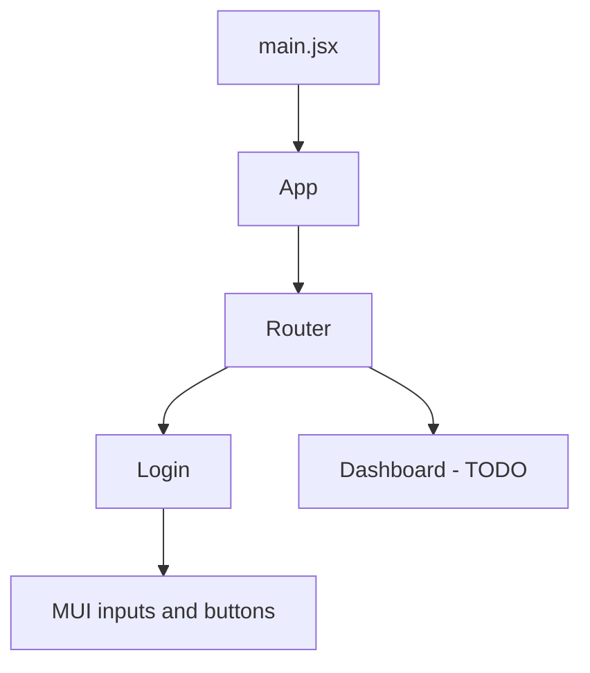

# Architecture

## Overview

Maple Sugaring is a single-page web app built with React. It lets users

This document explains how the code is organized and why. For setup
instructions, see the [README](../README.md).

## Tech Stack

| Area         | Choice                 | Notes                                 |
| ------------ | ---------------------- | ------------------------------------- |
| UI framework | React 18               | Function components and hooks only    |
| Build tool   | Vite                   | `npm run dev` / `npm run build`       |
| Component UI | MUI (Material UI)      | Customized with plain CSS files       |
| Routing      | React Router           |                                       |
| Backend/API  |                        |                                       |

## Folder Structure

```
src/
├── assets/       Images and static files (e.g. MapleLogo.png)
├── css/          Stylesheets: App.css (global), one file per page
├── pages/        One component per route (e.g. Login)
├── components/   Reusable UI pieces shared across pages
└── main.jsx      App entry point
```

Conventions:

- One page component per file, exported as a named export (`export function Login()`).
- Each page imports its own stylesheet; `App.css` holds global styles only.

## Component Structure



## Data Flow

- **Local UI state** (form values, show/hide password, error message) lives in
  the component with `useState`.
- **Server data** is fetched from the API when [TODO: on mount / on submit].
- **Auth state** [TODO: context, token in memory, cookie session, etc.].
  See [auth-flow.md](auth-flow.md).

## Key Design Decisions

- **MUI plus custom CSS.** MUI provides accessible inputs and buttons out of
  the box. Custom CSS in `css/` handles layout and branding (RIT orange
  `#F76902`).
- **Controlled form inputs.** Email and password are tracked in state so the
  values are available on submit and can be cleared after a failed login.
- **Accessibility.** The login error message uses `aria-live="assertive"` and
  receives focus on failure so screen reader users hear it.
  The email field is auto-focused on page load.

## Styling

- Global styles and page background: `css/App.css`
- Page-specific styles: `css/login.css` (scoped by IDs like `#login-page`)
- MUI overrides use class selectors such as `.field-with-label .MuiOutlinedInput-root`

## Known Limitations / TODO

- Login submit handler is a stub (no API call yet)
- "Forgot Password" flow not designed
- No automated tests yet