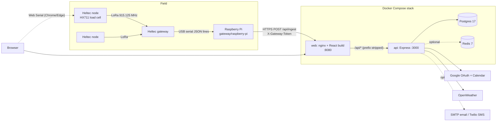
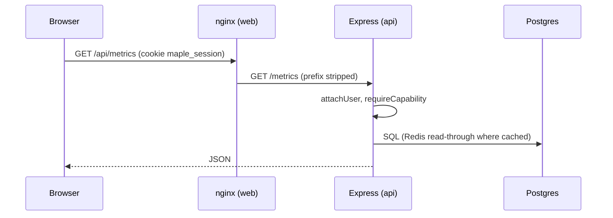
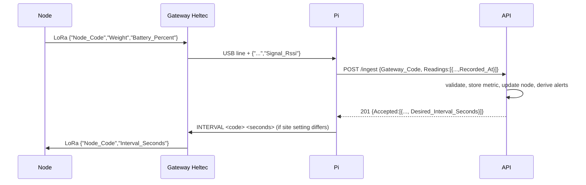

# Architecture

## System overview

Sap is collected in buckets that hang from load cells. Each bucket has a Heltec WiFi LoRa 32 V3 "node". Nodes radio their weight over LoRa to a Heltec "gateway" board that is plugged into a Raspberry Pi by USB. The Pi posts each reading to the API. Students and instructors use the web app to watch buckets, log collections, claim shifts, and manage hardware.



The browser also talks directly to a node over USB: the Deploy page uses Web Serial to flash firmware and name a board. See [deploy-and-flasher.md](deploy-and-flasher.md).

## Repository layout

| Path | What it is |
| --- | --- |
| `Maple-Sugar-FE/` | React 19 + Vite + Material UI app. Served by nginx in production. |
| `Maple-Sugar-BE/` | Express 5 API, SQL migrations, tests. |
| `firmware/heltec-v3-node/` | PlatformIO project for the sap node (environments `node_001`, `node_002`, `field`). |
| `firmware/heltec-v3-gateway/` | PlatformIO project for the receiving board (`gateway`). |
| `firmware/hx711-test/` | Bench sketch for the load cell amplifier (`heltec_v3`). |
| `gateway/raspberry-pi/` | Python Flask app plus serial reader that forwards to `/ingest`. |
| `docker-compose.yml` | `db`, `cache`, `api`, `web` services. |
| `.github/` | CI workflows and the Discord notifier. |
| `Maple-Sugar-FE/public/firmware/` | Prebuilt field firmware that the web flasher downloads. |
| `.claude/launch.json` | Local Claude Code preview config (mock-mode frontend on port 5174). Untracked, with absolute paths for one machine. |

## Request path



`/api` is stripped by nginx in Docker (`Maple-Sugar-FE/nginx.conf.template`) and by the Vite proxy in development (`Maple-Sugar-FE/vite.config.js`). Mounting routes under `/api` inside Express would produce `/api/api/...`.

## Backend layers

```
routes/ -> services/ -> repositories/ -> db (pg)
              \-> business/ (pure rules, shared logic with the UI)
         cache/ (Redis read-through, optional)   auth/ (JWT + Google OAuth)
```

Details in [backend.md](backend.md). A route may call a repository directly when the work is a single query.

## Frontend layers

```
pages/ -> services/ (hooks, orchestration) -> data/repositories -> data/apiClient
                                                                     |-> httpTransport (fetch, /api)
                                                                     '-> mockTransport (in-memory seed)
business/ (roles, validation, sugar/yield rules)   context/ (auth)   hardware/ (Web Serial flasher)
```

`VITE_API_MODE` (`http` or `mock`) is the only switch between the real API and the mock. Details in [frontend.md](frontend.md).

## Data flow for a sensor reading



Weight is gross pounds (bucket included). Air temperature is never sent by hardware; it comes from OpenWeather.

## Background work in the API

Started in `Maple-Sugar-BE/src/services/housekeeping.js`, first run 15 seconds after boot:

| Job | Interval | What it does |
| --- | --- | --- |
| Live weather poll | 10 min | Calls OpenWeather, may raise Sap Run and harsh-weather alerts. |
| Downed-node check (`nodeWatch.js`) | 5 min | Raises Node Offline (silent 45+ min or never reported) and Missed Readings (silent for two report intervals) for tracked, non-maintenance nodes. |
| Ingest buffer replay | 1 min | Replays batches spooled to `Maple-Sugar-BE/data/ingest-buffer.jsonl` while Postgres was unreachable. |

On boot (`server.js`) the API runs migrations, runs `clearSeededData`, promotes `BOOTSTRAP_ADMIN_EMAILS` to Admin, loads historic weather if `weather_days` is empty, connects Redis (optional), then listens.

## Security model in brief

- No password login against the real API. Google OAuth only, restricted to `ALLOWED_EMAIL_DOMAINS`, and only invited users may sign in.
- Session is a signed JWT in the `maple_session` cookie. The API re-reads the user on every request.
- Authorization is capability based. The frontend copy of the matrix hides UI; the API copy is the control. See [roles-and-logins.md](roles-and-logins.md).
- Sensor ingest uses a shared secret (`GATEWAY_INGEST_TOKEN`), not a user session. Unset means the route answers 503.
- nginx adds security headers (`Maple-Sugar-FE/security-headers.conf`); Express uses `helmet`.
