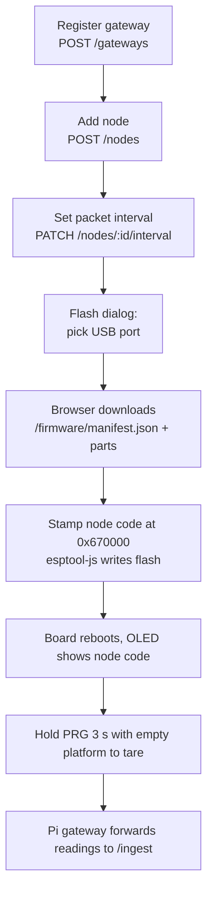

# Deploy page and Heltec flasher

The Deploy page (`/deploy`, nav label "Deploy") is where a gateway is registered, a tree (node) is added, and a Heltec board is flashed from the browser. Code: `Maple-Sugar-FE/src/pages/DeployPage.jsx` and `Maple-Sugar-FE/src/hardware/heltecFlash.js`. Requires the `deploy_nodes` capability (Admin and MSS). Flashing needs Chrome or Edge (Web Serial).

## Workflow



A stepper ("Register gateway", "Add node", ...) guides first-time setup. The "Add node" button is disabled until at least one gateway exists.

1. **Register a gateway.** Gateway code (letters, numbers, `-`, `_`, up to 50 characters) and a label. The code must equal `GATEWAY_CODE` on the Pi (default `GW-ALUMNI`).
2. **Add a node.** Fields: tree name, stand (`Alumni House`, `Chabad House`, `Red Barn`), gateway, latitude/longitude ("Use this location" uses the browser's geolocation), minutes between packets (1 to 1440), empty bucket weight in lb (default 2.5, used as tare), optional RF tag and notes. The API creates the node with the next free `NODE-nnn` code (for example `NODE-003`) and a bucket (`BKT-nnn` barcode by default).
3. **Flash.** After saving, the Flash dialog opens. It can also be reopened later from the node's menu or via deep link.
4. **Tare.** After flashing, hold the PRG button for 3 seconds with an empty platform.
5. Editing a node can change name, stand, location, RF tag, notes, gateway, and interval. Removing a node deletes its readings and alerts; the board keeps its firmware until cleared ("Clear the board").

Deep links: `/deploy?action=add`, `/deploy?edit=<nodeId>`, `/deploy?flash=<nodeId>`. The page consumes the parameter and clears it from the URL.

Node status chips: 0 Offline, 1 Online, 2 Degraded, 3 Maintenance.

## How flashing works (`heltecFlash.js`)

1. `loadFieldFirmware` fetches `/firmware/manifest.json` from the same site, then each part.

   | Part | Offset |
   | --- | --- |
   | `bootloader.bin` | `0x0` |
   | `partitions.bin` | `0x8000` |
   | `boot_app0.bin` | `0xE000` |
   | `firmware.bin` | `0x10000` |

   Chip family in the manifest is `ESP32-S3`.
2. `stampNodeCode` appends a 32-byte block at `0x670000` (unused SPIFFS area): the magic `MAPLEID1` followed by the node code (max 16 characters). The app image is not modified, so its checksum stays valid. At boot the firmware reads this block and uses it as its identity (`loadProvision` in the node firmware).
3. `flashHeltec` uses `esptool-js` (`ESPLoader`, `Transport`) at 115200 baud, flash size 8MB, mode `dio`, frequency 80m, compressed, no full erase, then `hard_reset`. It connects once; repeated USB resets crash Chrome on macOS per the code comments.
4. `eraseHeltec` erases the whole flash (firmware and stored node code).
5. Serial helpers `nameHeltec`, `provisionCommand`, `factoryCommand`, `writeSerialCommand` send `PROVISION {...}`, `FACTORY`, and read `PROVISIONED` or `CLEARED`. The current Deploy page flow flashes with the code stamped in the image; the `PROVISION`/`FACTORY` helpers are exported and tested (`test/heltecFlash.test.js`) but check `DeployPage.jsx` before relying on them (**TODO**: confirm whether any UI path still calls `nameHeltec`).

Bootloader tip shown in errors: hold PRG, tap RST, release PRG, then press Flash once.

## Serving the firmware

The browser downloads the files from `Maple-Sugar-FE/public/firmware/`, served at `/firmware/`. nginx sets `Cache-Control: no-cache, must-revalidate` there so a cached image is never written to a board.

These binaries are committed build outputs of the PlatformIO `field` environment. There is no script in the repo that rebuilds and copies them. To update:

```bash
cd firmware/heltec-v3-node
pio run -e field
# copy .pio/build/field/{bootloader.bin,partitions.bin,firmware.bin} into Maple-Sugar-FE/public/firmware/
# boot_app0.bin comes from the PlatformIO arduino-esp32 package (tools/partitions/boot_app0.bin)
```

**TODO**: the exact source path of `boot_app0.bin` and the build-to-publish steps were not scripted or documented in the repo; the paths above are the usual PlatformIO layout and have not been verified here. The `field` environment's `NODE_CODE` is the placeholder `MAPLENODE00000000` and its packet interval defaults to 20 s.

## Server-side routes used

| Action | Route | Capability |
| --- | --- | --- |
| List gateways | `GET /gateways` | dashboard or nodes |
| Register gateway | `POST /gateways` | `deploy_nodes` |
| Create node | `POST /nodes` | `deploy_nodes` |
| Edit node | `PATCH /nodes/:id/details` | `deploy_nodes` |
| Set interval | `PATCH /nodes/:id/interval` | `deploy_nodes` |
| Delete node | `DELETE /nodes/:id` | `deploy_nodes` |

Migration `010_node_deploy.sql` added `node.rf_tag` and `node.notes`. The interval is stored in `node.report_interval_seconds` and is returned to the Pi as `Desired_Interval_Seconds` on ingest, which relays it to the node over LoRa. See [hardware.md](hardware.md).
